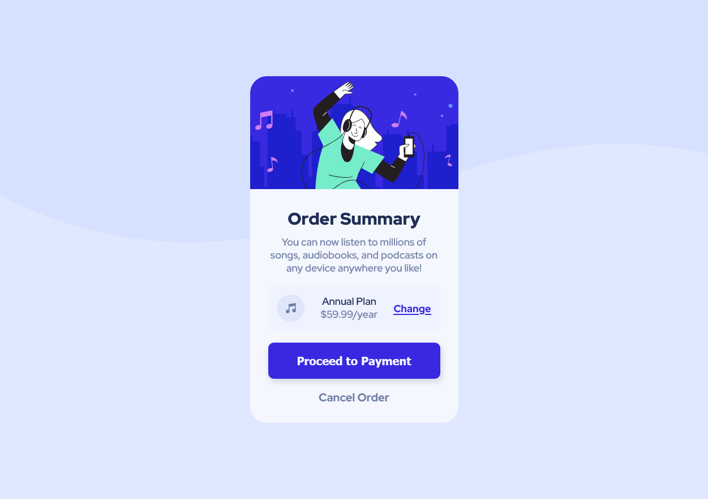

# Frontend Mentor - Order summary card solution

This is a solution to the [Order summary card challenge on Frontend Mentor](https://www.frontendmentor.io/challenges/order-summary-component-QlPmajDUj). Frontend Mentor challenges help you improve your coding skills by building realistic projects. 

## Table of contents

- [Overview](#overview)
  - [The challenge](#the-challenge)
  - [Screenshot](#screenshot)
- [My process](#my-process)
  - [Built with](#built-with)
  - [What I learned](#what-i-learned)
  - [Continued development](#continued-development)
  - [Useful resources](#useful-resources)
- [Author](#author)

## Overview

### The challenge

Users should be able to:

- See hover states for interactive elements

### Screenshot

## My process

### Built with

- Semantic HTML5 markup
- CSS custom properties
- Flexbox
- Mobile-first workflow

### What I learned

I learned a lot about using SVG files as background images which I used to struggle doing, I also got to play around more with fonts and making them more responsive.

### Continued development

I'm still not quite sure about what to do about accessibility when it comes to images being set as background-images, if there's no HTML tag, how can I add an alt attribute or something similar? I plan to start on projects that require Javascript soon as I need to put my skills to the test, even if it'll be quite more challenging.

### Useful resources

- [Kevin Powell](https://www.youtube.com/@KevinPowell) - Really taught me everything I know about responsive websites and helped me on this with his videos about font sizes and padding.

## Author

- Frontend Mentor - [@marisfreire](https://www.frontendmentor.io/profile/marisfreire)
- Twitter - [@marixfreire](https://www.twitter.com/marixfreire)

